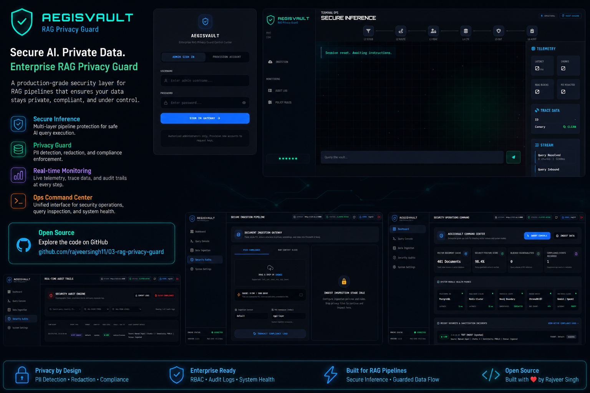
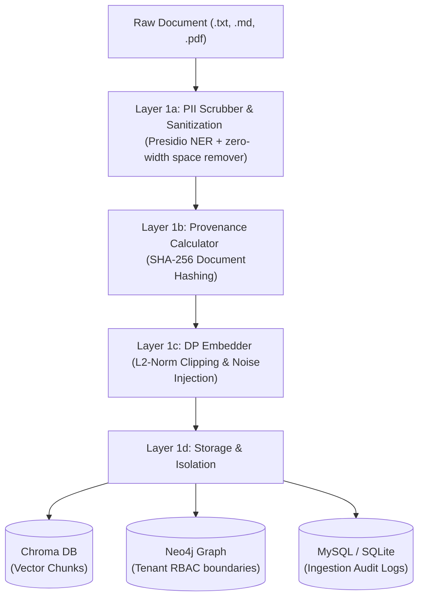
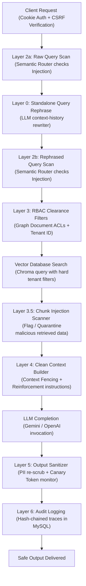

# AegisVault: Enterprise RAG Privacy Guard

AegisVault is a high-security, production-ready Retrieval-Augmented Generation (RAG) backend framework and management command center. It is designed to protect sensitive data during both document ingestion and LLM inference. AegisVault implements a **6-layer defense-in-depth model** to mitigate prompt injection, cross-tenant data leakage, PII exposure, and embedding inversion risks.

---

## 🏗️ System Architecture & Design



AegisVault isolates the offline document ingestion pipeline from the real-time inference request-response path. 

### 1. Ingestion Pipeline


### 2. Inference Query Pipeline


---

## ✨ Features & Layer Details

*   **Authentication & Session CSRF Security**
    *   Secure, HttpOnly, `SameSite=Strict` browser session cookie auth (`aegis_session`).
    *   **Double-Submit Cookie CSRF Middleware**: Validates a matching `X-CSRF-Token` header for state-changing requests, preventing cross-site request forgery attacks on browser endpoints.
*   **Layer 1: Ingestion Scrubber & DP Embedder**
    *   Uses Presidio (NER) to detect and redact PII *before* chunking.
    *   Quarantines documents containing critical secrets (API keys, passwords, SSNs) and encrypts raw contents.
    *   **Hardened DP Embedder**: Clips raw embedding vectors to an $L_2$ norm threshold to bound sensitivity, applies either **Laplace** (pure $\epsilon$-DP) or **Gaussian** (approximate $\epsilon, \delta$-DP) noise, and projects the resulting vector back to the unit hypersphere for valid cosine similarity search.
*   **Layer 2: Semantic Router**
    *   Classifies intents and blocks prompt injections, jailbreaks, and data exfiltration attempts.
    *   Protects the system against rephrase hijacking by scanning both the raw query and the history-rephrased standalone query.
*   **Layer 3: RBAC & Tenant Isolation**
    *   Enforces sensitivity clearances (`PUBLIC`, `INTERNAL`, `CONFIDENTIAL`, `RESTRICTED`).
    *   Filters vector search results strictly based on the user's `tenant_id` and assigned `roles` inside the Chroma database query.
    *   Supports hard isolation using an optional Neo4j Knowledge Graph boundary.
*   **Layer 3.5: Chunk Injection Scanner**
    *   Scans retrieved database chunks for indirect prompt injection markers and zero-width characters. Flagged chunks are quarantined or demoted to lower trust status.
*   **Layer 4: Clean Context Builder**
    *   Constructs a sanitized, deterministic prompt structure wrapping context inside explicit `=== BEGIN/END RETRIEVED CONTENT ===` fences.
    *   Appends reinforcement instructions to strictly restrict the LLM to context facts.
*   **Layer 5: Output Sanitizer & Canary Detection**
    *   Scans the LLM output for generated PII and redacts it.
    *   Monitors for Canary Tokens (high-entropy realistic secrets stored in the DB, e.g. `AEGIS-INTERNAL-MARKETING-PII-*`) to detect and alert on data leaks.
*   **Layer 6: Privacy-Safe Audit Logging**
    *   Logs query traces, RBAC blocks, PII redactions, and latency to a relational database, generating SHA-256 chained trace hashes.

## 📂 Repository Structure (System Template)

The project follows a structured package layout defined in the initialization template ([template.py](file:///D:/Projects/portfolio/03-rag-privacy-guard/template.py)):

```text
├── .github/workflows/
│   └── .gitkeep                    # GitHub CI/CD Action workflows placeholder
├── config/
│   └── config.yaml                 # Application path and static configurations
├── frontend/                       # React (Vite + Tailwind CSS v4) Management Dashboard
├── src/
│   └── aegisVault/                 # Main backend package source
│       ├── __init__.py
│       ├── access/
│       │   ├── __init__.py
│       │   └── rbac.py             # Authorization checks and policies (RBAC)
│       ├── app/
│       │   ├── __init__.py
│       │   ├── deps.py             # FastAPI dependency injection (cookie/API key authentication)
│       │   ├── main.py             # FastAPI production initialization and lifespans
│       │   └── routers/            # API Router endpoints (query, ingest, auth, events)
│       ├── config/
│       │   ├── __init__.py
│       │   └── manager.py          # Configuration manager for parsing config/params YAML
│       ├── constants/
│       │   ├── __init__.py
│       │   └── constants.py        # System constants definition
│       ├── db/
│       │   ├── __init__.py
│       │   ├── session.py          # SQLAlchemy engine, session maker, and DB health checks
│       │   └── alembic/            # Alembic schema versioning migrations directory
│       ├── entity/
│       │   ├── __init__.py
│       │   ├── config_entity.py    # Pydantic schema mappings for params config
│       │   └── artifact_entity.py  # Ingestion/Inference typing artifacts definitions
│       ├── guards/
│       │   ├── __init__.py
│       │   ├── ingestion_scrubber.py # Layer 1: PII NER extraction and secret scrubbing
│       │   ├── privacy_math.py       # Layer 1: L2 clipping and Differential Privacy noise
│       │   ├── semantic_router.py    # Layer 2: Prompt Injection and category routing classification
│       │   ├── graph_boundary.py     # Layer 3: Multi-tenant Graph isolation filter (Neo4j)
│       │   └── output_sanitizer.py   # Layer 5: Canary tokens and final LLM output scrubber
│       ├── pipeline/
│       │   ├── __init__.py
│       │   ├── ingestion_pipeline.py # Offline asynchronous pipeline (scrub → DP embed → vector index)
│       │   └── inference_pipeline.py # Real-time guarded query pipeline (scrub → retrieve → context → LLM)
│       ├── utils/
│       │   ├── __init__.py
│       │   └── common.py             # Common utilities (custom logging and parsing helpers)
│       └── worker.py                 # Celery asynchronous execution entry point
├── tests/                          # Pytest suite
│   ├── test_auth.py                # Admin session & cookie CSRF security testing
│   ├── test_dp_embedder.py         # DP math, L2-clipping & Gaussian noise verification tests
│   └── test_security_controls.py   # RBAC, semantic router fail-close, and ingestion scrub tests
├── params.yaml                     # Main operational parameters (Epsilon, confidence threshold, etc.)
├── run.py                          # Stack command-line orchestrator and entry launcher
├── setup.py                        # Makes backend installable as a pip package
├── requirements.txt                # Basic python package requirements definition
├── docker-compose.yaml             # Spins up backing containers (Redis, MySQL, Neo4j, Chroma)
└── template.py                     # Repository initialization script detailing structural layout
```

---

## 🛠️ Setup & Execution

### 1. Clone the Repository
Clone the repository using HTTPS or SSH and navigate to the project root:
```bash
# Via HTTPS
git clone https://github.com/rajveersingh11/03-rag-privacy-guard.git
cd 03-rag-privacy-guard

# Or via SSH
git clone git@github.com:rajveersingh11/03-rag-privacy-guard.git
cd 03-rag-privacy-guard
```

### 2. Environment Variables
Copy `.env.example` to `.env` and configure your credentials:
```text
APP_ENV=development
API_KEY=your_secret_api_key_here
GOOGLE_API_KEY=your_google_ai_key
OPENAI_API_KEY=your_openai_api_key

# Services
DATABASE_URL=sqlite:///./data/aegisdb.sqlite  # Or MySQL/Postgres URL
REDIS_URL=redis://localhost:6379/0
NEO4J_URI=bolt://localhost:7687
NEO4J_USER=neo4j
NEO4J_PASSWORD=password

# Security & Privacy Math
QUARANTINE_ENCRYPTION_KEY=your_32_byte_base64_fernet_key
CORS_ALLOWED_ORIGINS=http://localhost:8000,http://localhost:5173
MAX_DP_QUERIES_PER_USER_PER_DAY=100
METRICS_TOKEN=your_metrics_scraping_token
```

### 3. Unified Runner (`run.py`)
All services can be orchestrated using the [run.py](file:///D:/Projects/portfolio/03-rag-privacy-guard/run.py) script located in the root directory.

#### 💻 Local Development Stack
Runs backing compose containers, Celery workers, and Vite frontend hot-reloads simultaneously:
```powershell
python run.py dev
```
*Vite frontend is accessible at `http://localhost:5173/`.*

#### 🚀 Production Build & Serve
Compiles the React frontend static bundles and serves them directly through the FastAPI endpoint:
```powershell
python run.py prod
```
*Unified application is accessible at `http://localhost:8000/`.*

#### 🛑 Stop Docker Compose Containers
```powershell
python run.py stop
```

---

## 🧪 Development & Testing

Run the security unit tests (which validates cookie sessions, CSRF headers, and unnormalized DP clipping bounds):
```powershell
python run.py test
```

---

## 🔌 API Examples

### 1. Ingest a Document (S2S API Key Auth)
```powershell
curl -X POST "http://127.0.0.1:8000/ingest/file?async=false" `
  -H "X-API-Key: $env:API_KEY" `
  -F "file=@confidential_report.pdf" `
  -F "tenant_id=acme_corp" `
  -F "acl_roles=executive,manager"
```

### 2. Guarded Query (S2S API Key Auth)
```powershell
curl -X POST "http://127.0.0.1:8000/query" `
  -H "Content-Type: application/json" `
  -H "X-API-Key: $env:API_KEY" `
  -d '{
    "query": "What are the Q3 targets?",
    "user_id": "usr_998",
    "user_roles": ["employee"],
    "tenant_id": "acme_corp"
  }'
```

### 3. Admin Account Provision (CSRF Bypassed Signup)
```powershell
curl -X POST "http://127.0.0.1:8000/auth/signup" `
  -H "Content-Type: application/json" `
  -d '{
    "username": "superadmin",
    "password": "supersecurepassword"
  }'
```
*(Sets browser session cookie `aegis_session` and CSRF cookie `aegis_csrf`)*

### 4. Admin Logout (Session Revocation & Cookie Cleanup)
```powershell
curl -X POST "http://127.0.0.1:8000/auth/logout" `
  -H "X-CSRF-Token: your_aegis_csrf_value"
```